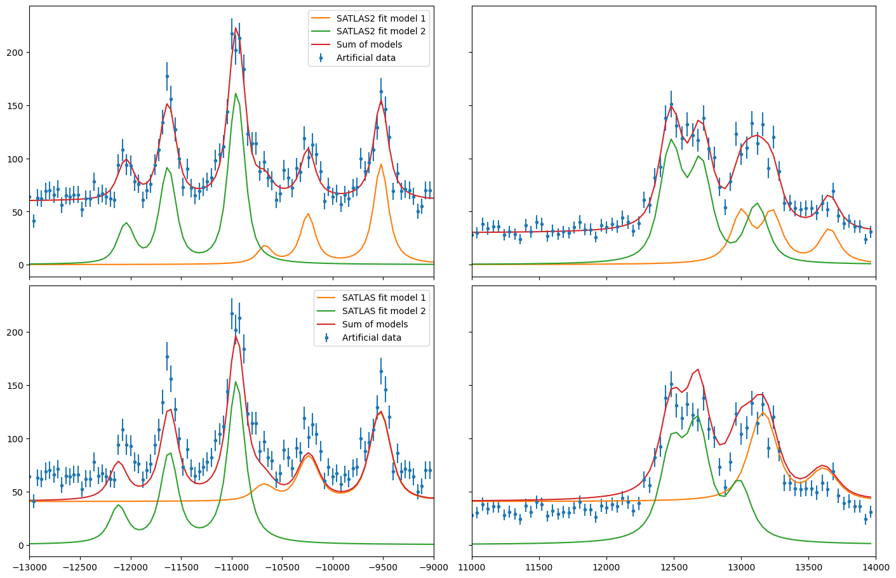

Using the satlas1 interface
===========================

As a stepping stone between SATLAS and SATLAS2, an interface has been
provided which can mostly be used as a drop-in replacement for code that
uses the SATLAS syntax. Note that not all functionalities have been
implemented in this fashion. For users that require these
functionalities, we recommend migrating to SATLAS2.

.. code:: ipython3

    import sys
    import time
    
    import matplotlib.gridspec as gridspec
    import matplotlib.pyplot as plt
    import numpy as np
    
    sys.path.insert(0, '..\src')
    
    import satlas2
    import satlas as sat
    
    
    def modifiedSqrt(input):
        output = np.sqrt(input)
        output[input <= 0] = 1e-3
        return output

Fitting a single hyperfine spectrum
===================================

The most common task, and the one this interface is meant for, is
fitting a single hyperfine spectrum. A special class in SATLAS2 called
*HFSModel* has been created as a replacement for the equivalent SATLAS
*HFSModel*. Note that the normal hyperfine spectrum model in SATLAS2 is
called *HFS*.

.. code:: ipython3

    spin = 3.5
    J = [0.5, 1.5]
    A = [9600, 175]
    B = [0, 315]
    C = [0, 0]
    FWHMG = 135
    FWHML = 101
    centroid = 480
    bkg = [100]
    scale = 90
    
    x = np.arange(-17500, -14500, 40)
    x = np.hstack([x, np.arange(20000, 23000, 40)])
    
    rng = np.random.default_rng(0)
    hfs = satlas2.HFSModel(I=spin,
                           J=J,
                           ABC=[A[0], A[1], B[0], B[1], C[0], C[1]],
                           centroid=centroid,
                           fwhm=[FWHMG, FWHML],
                           scale=scale,
                           background_params=bkg,
                           use_racah=True)
    

The object called *hfs* can be used with the syntax of SATLAS.
Generating Poisson-distributed data is done by simply calling the
function with frequency values as an argument, and using the result for
the NumPy Poisson random number generator.

.. code:: ipython3

    y = hfs(x)
    y = rng.poisson(y)

In order to demonstrate the difference in performance, the centroid is
offset by 100 from the actual value and the fitting is done by both the
interface and SATLAS.

.. code:: ipython3

    hfs.params['centroid'].value = centroid - 100
    hfs1 = sat.HFSModel(spin,
                        J, [A[0], A[1], B[0], B[1], C[0], C[1]],
                        centroid - 100, [FWHMG, FWHML],
                        scale=scale,
                        background_params=bkg,
                        use_racah=True)
    hfs1.set_variation({'Cu': False, 'Cl': False})
    
    print('Fitting 1 dataset with chisquare (Pearson, satlas2)...')
    start = time.time()
    f = satlas2.chisquare_fit(hfs, x, y, modifiedSqrt(y), show_correl=False)
    stop = time.time()
    dt1 = stop - start
    
    print('Fitting 1 dataset with chisquare (Pearson, satlas1)...')
    start = time.time()
    sat.chisquare_fit(hfs1, x, y, modifiedSqrt(y))
    hfs1.display_chisquare_fit(show_correl=False)
    stop = time.time()
    dt2 = stop - start
    print('SATLAS2: {:.3} s, {:.0f} function evaluations'.format(
        dt1, f.result.nfev))
    print('SATLAS1: {:.3} s'.format(dt2))
    
    fig = plt.figure(constrained_layout=True, figsize=(14, 9))
    gs = gridspec.GridSpec(nrows=2, ncols=2, figure=fig)
    ax11 = fig.add_subplot(gs[0, 0])
    ax11.label_outer()
    ax12 = fig.add_subplot(gs[0, 1])
    ax12.label_outer()
    ax21 = fig.add_subplot(gs[1, 0])
    ax21.label_outer()
    ax22 = fig.add_subplot(gs[1, 1])
    ax22.label_outer()
    
    ax11.errorbar(x, y, modifiedSqrt(y), fmt='.', label='Artificial data')
    ax11.plot(x, hfs(x), '-', label='SATLAS2 fit')
    ax11.set_xlim(-17500, -14500)
    ax12.errorbar(x, y, modifiedSqrt(y), fmt='.', label='Artificial data')
    ax12.plot(x, hfs(x), '-', label='SATLAS2 fit')
    ax12.set_xlim(20000, 23000)
    ax21.errorbar(x, y, modifiedSqrt(y), fmt='.', label='Artificial data')
    ax21.plot(x, hfs1(x), '-', label='SATLAS fit')
    ax21.set_xlim(-17500, -14500)
    ax22.errorbar(x, y, modifiedSqrt(y), fmt='.', label='Artificial data')
    ax22.plot(x, hfs1(x), '-', label='SATLAS fit')
    ax22.set_xlim(20000, 23000)
    ax11.legend()
    ax21.legend()
    plt.show()
    

.. parsed-literal::

    Fitting 1 dataset with chisquare (Pearson, satlas2)...
    [[Fit Statistics]]
        # fitting method   = leastsq
        # function evals   = 137
        # data points      = 150
        # variables        = 8
        chi-square         = 151.188938
        reduced chi-square = 1.06471083
        Akaike info crit   = 17.1842512
        Bayesian info crit = 41.2693335
    [[Variables]]
        Fit___HFModel__3_5___centroid:  482.548153 +/- 7.56664273 (1.57%) (init = 380)
        Fit___HFModel__3_5___Al:        9604.53248 +/- 6.41301473 (0.07%) (init = 9600)
        Fit___HFModel__3_5___Au:        176.460908 +/- 2.73509313 (1.55%) (init = 175)
        Fit___HFModel__3_5___Bl:        0 (fixed)
        Fit___HFModel__3_5___Bu:        348.564601 +/- 19.6945247 (5.65%) (init = 315)
        Fit___HFModel__3_5___Cl:        0 (fixed)
        Fit___HFModel__3_5___Cu:        0 (fixed)
        Fit___HFModel__3_5___FWHMG:     142.382561 +/- 57.6647446 (40.50%) (init = 135)
        Fit___HFModel__3_5___FWHML:     100.522928 +/- 63.5247534 (63.19%) (init = 101)
        Fit___HFModel__3_5___scale:     89.2398294 +/- 7.15348131 (8.02%) (init = 90)
        Fit___HFModel__3_5___Amp3to2:   0.4545455 (fixed)
        Fit___HFModel__3_5___Amp3to3:   0.4772727 (fixed)
        Fit___HFModel__3_5___Amp3to4:   0.3409091 (fixed)
        Fit___HFModel__3_5___Amp4to3:   0.1590909 (fixed)
        Fit___HFModel__3_5___Amp4to4:   0.4772727 (fixed)
        Fit___HFModel__3_5___Amp4to5:   1 (fixed)
        Fit___bkg___p0:                 100.670728 +/- 1.59295185 (1.58%) (init = 100)
    Fitting 1 dataset with chisquare (Pearson, satlas1)...
    

.. parsed-literal::

    Chisquare fitting done: 172it [00:00, 190.57it/s]                            
    

.. parsed-literal::

    NDoF: 142, Chisquare: 151.18894, Reduced Chisquare: 1.0647108
    Akaike Information Criterium: 17.18425, Bayesian Information Criterium: 41.269333
    Errors not scaled with reduced chisquare.
    [[Variables]]
        FWHMG:        142.398641 +/- 55.8806202 (39.24%) (init = 142.3867)
        FWHML:        100.507637 +/- 61.5685626 (61.26%) (init = 100.519)
        TotalFWHM:    203.616071 +/- 20.6442157 (10.14%) == '0.5346*FWHML+(0.2166*FWHML**2+FWHMG**2)**0.5'
        Scale:        89.2388854 +/- 6.93231223 (7.77%) (init = 89.23958)
        Saturation:   0 (fixed)
        Amp3__2:      0.4546399 (fixed)
        Amp3__3:      0.4773649 (fixed)
        Amp3__4:      0.3410048 (fixed)
        Amp4__3:      0.1591578 (fixed)
        Amp4__4:      0.4773975 (fixed)
        Amp4__5:      1 (fixed)
        Al:           9604.53225 +/- 6.21516055 (0.06%) (init = 9604.532)
        Au:           176.461706 +/- 2.65071396 (1.50%) (init = 176.4611)
        Bl:           0 (fixed)
        Bu:           348.556407 +/- 19.0869596 (5.48%) (init = 348.5624)
        Cl:           0 (fixed)
        Cu:           0 (fixed)
        Centroid:     482.545220 +/- 7.33323399 (1.52%) (init = 482.5474)
        Background0:  100.670920 +/- 1.54379765 (1.53%) (init = 100.6708)
        N:            0 (fixed)
    SATLAS2: 0.05 s, 137 function evaluations
    SATLAS1: 0.914 s
    

.. image:: output_7_6.png

Note that the results are functionally identical: the slight difference
is due to a more modern implementation of the least squares fitting
routine that is used under the hood by SATLAS2. The speedup by using
SATLAS 2 is about a factor 20 for a single spectrum.

Overlapping hyperfine spectra
=============================

The other most common usecase for SATLAS was analysis of spectra with an
isomer present, resulting in overlapping spectra. In the SATLAS
terminology, this would result in a *SumModel* being used. In SATLAS2, a
second *HFS* is simply added to the Source. However, the interface does
provide the folllowing functionality:

.. code:: ipython3

    J = [0.5, 1.5]
    FWHMG = 135
    FWHML = 101
    
    spin1 = 4
    A1 = [5300, 100]
    B1 = [0, 230]
    C1 = [0, 0]
    centroid1 = 400
    bkg1 = 60
    scale1 = 90
    
    spin2 = 7
    A2 = [3300, 60]
    B2 = [0, 270]
    C2 = [0, 0]
    centroid2 = -100
    bkg2 = 30
    scale2 = 160
    
    x = np.arange(-13000, -9000, 40)
    x = np.hstack([x, np.arange(11000, 14000, 40)])
    rng = np.random.default_rng(0)
    
    hfs1 = satlas2.HFSModel(I=spin1,
                            J=J,
                            ABC=[A1[0], A1[1], B1[0], B1[1], C1[0], C1[1]],
                            centroid=centroid1,
                            fwhm=[FWHMG, FWHML],
                            scale=scale1,
                            background_params=[bkg1],
                            use_racah=True)
    hfs2 = satlas2.HFSModel(I=spin2,
                            J=J,
                            ABC=[A2[0], A2[1], B2[0], B2[1], C2[0], C2[1]],
                            centroid=centroid2,
                            fwhm=[FWHMG, FWHML],
                            scale=scale2,
                            background_params=[bkg2],
                            use_racah=True)
    y = hfs1.f(x) + hfs2.f(x) + satlas2.Step([bkg1, bkg2], [0]).f(x)
    y = rng.poisson(y)
    
    hfs1.params['centroid'].value = centroid1 - 100
    hfs2.params['centroid'].value = centroid2 - 100
    summodel = satlas2.SumModel([hfs1, hfs2], {
        'values': [bkg1, bkg2],
        'bounds': [0]
    })
    
    hfs3 = sat.HFSModel(spin1,
                        J, [A1[0], A1[1], B1[0], B1[1], C1[0], C1[1]],
                        centroid - 100, [FWHMG, FWHML],
                        scale=scale1,
                        background_params=bkg,
                        use_racah=True)
    hfs4 = sat.HFSModel(spin2,
                        J, [A2[0], A2[1], B2[0], B2[1], C2[0], C2[1]],
                        centroid - 100, [FWHMG, FWHML],
                        scale=scale2,
                        background_params=[0],
                        use_racah=True)
    hfs4.set_variation({'Cu': False, 'Cl': False, 'Background0': False})
    summodel2 = hfs3 + hfs4
    
    print('Fitting 1 dataset with chisquare (Pearson, satlas2)...')
    start = time.time()
    f = satlas2.chisquare_fit(summodel, x, y, modifiedSqrt(y), show_correl=False)
    stop = time.time()
    dt1 = stop - start
    start = time.time()
    sat.chisquare_fit(summodel2, x, y, modifiedSqrt(y))
    summodel2.display_chisquare_fit(show_correl=False)
    stop = time.time()
    dt2 = stop - start
    print('SATLAS2: {:.3} s, {:.0f} function evaluations'.format(
        dt1, f.result.nfev))
    print('SATLAS1: {:.3} s'.format(dt2, f.result.nfev))
    
    fig = plt.figure(constrained_layout=True, figsize=(14, 9))
    gs = gridspec.GridSpec(nrows=2, ncols=2, figure=fig)
    ax11 = fig.add_subplot(gs[0, 0])
    ax11.label_outer()
    ax12 = fig.add_subplot(gs[0, 1])
    ax12.label_outer()
    ax21 = fig.add_subplot(gs[1, 0])
    ax21.label_outer()
    ax22 = fig.add_subplot(gs[1, 1])
    ax22.label_outer()
    
    ax11.errorbar(x, y, modifiedSqrt(y), fmt='.', label='Artificial data')
    ax11.plot(x, hfs1.f(x), '-', label='SATLAS2 fit model 1')
    ax11.plot(x, hfs2.f(x), '-', label='SATLAS2 fit model 2')
    ax11.plot(x, summodel.f(x), '-', label='Sum of models')
    ax11.set_xlim(-13000, -9000)
    ax12.errorbar(x, y, modifiedSqrt(y), fmt='.', label='Artificial data')
    ax12.plot(x, hfs1.f(x), '-', label='SATLAS2 fit model 1')
    ax12.plot(x, hfs2.f(x), '-', label='SATLAS2 fit model 2')
    ax12.plot(x, summodel.f(x), '-', label='Sum of models')
    ax12.set_xlim(11000, 14000)
    ax11.legend()
    
    ax21.errorbar(x, y, modifiedSqrt(y), fmt='.', label='Artificial data')
    ax21.plot(x, hfs3(x), '-', label='SATLAS fit model 1')
    ax21.plot(x, hfs4(x), '-', label='SATLAS fit model 2')
    ax21.plot(x, summodel2(x), '-', label='Sum of models')
    ax21.set_xlim(-13000, -9000)
    ax22.errorbar(x, y, modifiedSqrt(y), fmt='.', label='Artificial data')
    ax22.plot(x, hfs3(x), '-', label='SATLAS fit model 1')
    ax22.plot(x, hfs4(x), '-', label='SATLAS fit model 2')
    ax22.plot(x, summodel2(x), '-', label='Sum of models')
    ax22.set_xlim(11000, 14000)
    ax21.legend()
    plt.show()

.. parsed-literal::

    Fitting 1 dataset with chisquare (Pearson, satlas2)...
    [[Fit Statistics]]
        # fitting method   = leastsq
        # function evals   = 478
        # data points      = 175
        # variables        = 16
        chi-square         = 177.740442
        reduced chi-square = 1.11786441
        Akaike info crit   = 34.7192061
        Bayesian info crit = 85.3557816
    [[Variables]]
        Fit___HFModel__4___centroid:       414.235866 +/- 5.99620727 (1.45%) (init = 300)
        Fit___HFModel__4___Al:             5311.00532 +/- 4.29854814 (0.08%) (init = 5300)
        Fit___HFModel__4___Au:             105.690572 +/- 1.88731364 (1.79%) (init = 100)
        Fit___HFModel__4___Bl:             0 (fixed)
        Fit___HFModel__4___Bu:             206.351613 +/- 16.1503450 (7.83%) (init = 230)
        Fit___HFModel__4___Cl:             0 (fixed)
        Fit___HFModel__4___Cu:             0 (fixed)
        Fit___HFModel__4___FWHMG:          66.4215352 +/- 61.6718544 (92.85%) (init = 135)
        Fit___HFModel__4___FWHML:          147.233143 +/- 34.7935972 (23.63%) (init = 101)
        Fit___HFModel__4___scale:          94.0795118 +/- 7.05769957 (7.50%) (init = 90)
        Fit___HFModel__4___Amp7_2to5_2:    0.5 (fixed)
        Fit___HFModel__4___Amp7_2to7_2:    0.4938272 (fixed)
        Fit___HFModel__4___Amp7_2to9_2:    0.3395062 (fixed)
        Fit___HFModel__4___Amp9_2to7_2:    0.1728395 (fixed)
        Fit___HFModel__4___Amp9_2to9_2:    0.4938272 (fixed)
        Fit___HFModel__4___Amp9_2to11_2:   1 (fixed)
        Fit___HFModel__7___centroid:      -102.736222 +/- 3.68568089 (3.59%) (init = -200)
        Fit___HFModel__7___Al:             3299.43391 +/- 1.66241264 (0.05%) (init = 3300)
        Fit___HFModel__7___Au:             60.0867909 +/- 0.66024797 (1.10%) (init = 60)
        Fit___HFModel__7___Bl:             0 (fixed)
        Fit___HFModel__7___Bu:             278.393168 +/- 10.6108880 (3.81%) (init = 270)
        Fit___HFModel__7___Cl:             0 (fixed)
        Fit___HFModel__7___Cu:             0 (fixed)
        Fit___HFModel__7___FWHMG:          115.052496 +/- 26.0682420 (22.66%) (init = 135)
        Fit___HFModel__7___FWHML:          119.749223 +/- 22.4864359 (18.78%) (init = 101)
        Fit___HFModel__7___scale:          161.302769 +/- 6.72809476 (4.17%) (init = 160)
        Fit___HFModel__7___Amp13_2to11_2:  0.6666667 (fixed)
        Fit___HFModel__7___Amp13_2to13_2:  0.5530864 (fixed)
        Fit___HFModel__7___Amp13_2to15_2:  0.3358025 (fixed)
        Fit___HFModel__7___Amp15_2to13_2:  0.2246914 (fixed)
        Fit___HFModel__7___Amp15_2to15_2:  0.5530864 (fixed)
        Fit___HFModel__7___Amp15_2to17_2:  1 (fixed)
        Fit___bkg___value1:                29.7525779 +/- 1.13506378 (3.82%) (init = 30)
        Fit___bkg___value0:                59.6312766 +/- 1.32243213 (2.22%) (init = 60)
    

.. parsed-literal::

    Chisquare fitting done: 406it [00:11, 34.80it/s]                            
    

.. parsed-literal::

    NDoF: 159, Chisquare: 805.45528, Reduced Chisquare: 5.0657565
    Akaike Information Criterium: 299.1588, Bayesian Information Criterium: 349.79538
    Errors not scaled with reduced chisquare.
    [[Variables]]
        s0_FWHMG:          51.7850360 +/- 108.077126 (208.70%) (init = 51.78504)
        s0_FWHML:          202.518837 +/- 39.5642239 (19.54%) (init = 202.5188)
        s0_TotalFWHM:      215.808637 +/- 25.2286012 (11.69%) == '0.5346*s0_FWHML+(0.2166*s0_FWHML**2+s0_FWHMG**2)**0.5'
        s0_Scale:          85.8738089 +/- 6.45428695 (7.52%) (init = 85.87381)
        s0_Saturation:     0 (fixed)
        s0_Amp7_2__5_2:    0.5000937 (fixed)
        s0_Amp7_2__7_2:    0.4939217 (fixed)
        s0_Amp7_2__9_2:    0.3396039 (fixed)
        s0_Amp9_2__7_2:    0.172911 (fixed)
        s0_Amp9_2__9_2:    0.4939521 (fixed)
        s0_Amp9_2__11_2:   1 (fixed)
        s0_Al:             5295.42264 +/- 5.29872004 (0.10%) (init = 5295.423)
        s0_Au:             95.9154611 +/- 2.23512466 (2.33%) (init = 95.91546)
        s0_Bl:             0 (fixed)
        s0_Bu:             419.720297 +/- 18.1407639 (4.32%) (init = 419.7203)
        s0_Cl:             0 (fixed)
        s0_Cu:            -20.8934269 +/- 1.70274362 (8.15%) (init = -20.89343)
        s0_Centroid:       406.200804 +/- 7.25498546 (1.79%) (init = 406.2008)
        s0_Background0:    40.5909569 +/- 1.02170595 (2.52%) (init = 40.59096)
        s0_N:              0 (fixed)
        s1_FWHMG:          95.8491973 +/- 31.4832996 (32.85%) (init = 95.8492)
        s1_FWHML:          151.327945 +/- 22.0188386 (14.55%) (init = 151.3279)
        s1_TotalFWHM:      199.842092 +/- 12.2806615 (6.15%) == '0.5346*s1_FWHML+(0.2166*s1_FWHML**2+s1_FWHMG**2)**0.5'
        s1_Scale:          156.608723 +/- 6.62249774 (4.23%) (init = 156.6087)
        s1_Saturation:     0 (fixed)
        s1_Amp13_2__11_2:  0.666746 (fixed)
        s1_Amp13_2__13_2:  0.5531882 (fixed)
        s1_Amp13_2__15_2:  0.3359059 (fixed)
        s1_Amp15_2__13_2:  0.2247785 (fixed)
        s1_Amp15_2__15_2:  0.55321 (fixed)
        s1_Amp15_2__17_2:  1 (fixed)
        s1_Al:             3298.55781 +/- 1.72571611 (0.05%) (init = 3298.558)
        s1_Au:             59.4228475 +/- 0.68674265 (1.16%) (init = 59.42285)
        s1_Bl:             0 (fixed)
        s1_Bu:             287.559108 +/- 10.9370777 (3.80%) (init = 287.5591)
        s1_Cl:             0 (fixed)
        s1_Cu:             0 (fixed)
        s1_Centroid:      -104.839913 +/- 3.72279244 (3.55%) (init = -104.8399)
        s1_Background0:    0 (fixed)
        s1_N:              0 (fixed)
    SATLAS2: 0.206 s, 478 function evaluations
    SATLAS1: 11.7 s
    

The difference in result is due to the original SATLAS not implementing
a Step background model, where the constant background has a different
value left and right of some user-provided threshold value. Notice here
that the speedup bue using the SATLAS2 implementation has risen from a
factor 20 for a single spectrum to a factor 60.

